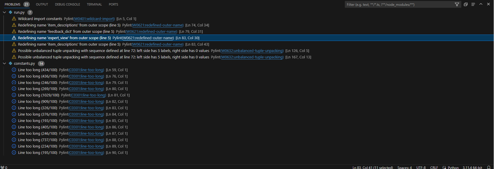

---
# *The Winter Survival Exercise*

The Winter Survival Exercise is a Python-based programme based on a groupwork exercise normally used for team-building. It involves a scenario where surviviors of a plane crash in Northern Canada have to prioritise a set of items in order of importance for their survival. The Winter Survival Exercise is a one-person adaptation of the groupwork exercise, where the user, as a lone survivor, has to choose five items from a list of twelve according to how important they consider them for their survival.

Initially developed by a US Army survival expert, the items have been ranked by the expert. The aim of the exercise is to choose items that match the expert's choices, and the game is scored by how differently the user prioritises items compared with the expert. After the user has chosen their items they can choose to see the expert's evaluation of the usefulness of the items they chose.

As in all aspects of survival, the expert's items are not the be-all and end-all, as in a real-world situation the user's ability to use the items and other decisions made by the user would have a major impact on their ability to survive. But nonetheless, the expert's rankings are indicative of the priorities that would provide the best odds of survival.

The Winter Survival Exercise is designed to be educational, teaching the user about prioritisation in a cold-weather survival scenario, testing the user's knowledge of survival and the science behind the items' usefulness, and also to be fun to do!

Whilst the current game is focused on the winter survival scenario, its format and code lend themselves to being expanded and changed to cover different scenarios, as well as to adding further interactive content through a day-by-day decision log.
 
The GitHub page for the Winter Survival Exercise can be accessed [here](https://github.com/JL-14/winter-survival).

---
## User Stories

### First Time Visitor Goals

* On my first visit, I want to easily find out what the Winter Survival Exercise is about.
* On my first visit, I want to be able to easily find instructions on how to complete the exercise.
* On my first visit, I want to easily be able to complete the exercise, understanding the flow of the programme.
* On my first visit, I want to see and understand my score after completing the game.

### Returning Visitor Goals

* On my return visit, I want to be able to easily start a new game.
* On my return visit, I want to be able to complete the exercise to see if I can get a better score than on my last visit.

### Frequent Visitor Goals

* As a frequent visitor to the site, I want to see whether there is new content and new scenarios to complete.
* As a frequent visitor, I want to complete the exercise again to see if I can get an even better score.
* As a frequent visitor, I want to see the expert's feedback for all the different items, and to fully understand how all the possible items might be helpful (or not) for the purposes of survival.

---

## Features

### Throughout the programme

- The font colours indicate the nature of the information:
    * White font is the narrative of the exercise
    * Yellow font indicates that user input is required
    * Green font indicates that the text represents input from the expert
    * Red font indicates that the user input is incorrect 

### Introduction to the exercise

- The exercise starts with a short introduction welcoming the user, asking the user to press Enter when they are ready to begin.
- The user is also informed that they can exit the exercise at any time by pressing the Ctrl + C buttons on their keyboard.

### Scenario section

- The user is then taken through the scenario for the exercise, as well as given some details about likely priorities and how the exercise is scored. 
- The user is invited to press Enter to see how the game is scored. 

### Scoring section

- The next section contains information about how the exercise is scored, and a general observation that survival is as dependent on skills and knowledge as on having specific items to hand.
- The user is then invited to press Enter to see the twelve items and begin to choose their five items in order of priority. 

### Items list and user choices

- The twelve items from which the user has to choose five is then presented in table format.
- Underneath the table the user is asked to choose one of the twelve items as their highest priority item for survival in the given environment, repeated for each of the user's five items of choice.
- When the user has chosen five items, the items are listed back to the user and they are asked to confirm that they are happy with their selection.
- If they are not happy with what they chose the table of items will be displayed again, and they will be given a second opportunity to select items
- If they make an incorrect entry (a non-numerical entry, an entry outside the range 1-12, an empty entry, or a duplicate entry of an item already chosen), an error will appear and they will need to choose again.

### Score and feedback

- Once the user has made their choices the score is calculated in accordance with the scoring information presented at the start of the exercise, and presented as a number with an accompanying statement (Excellent, Very Good, OK, or Poor) depending on the score.

### Expert feedback on items chosen

- After they have been presented with the score, the user is invited to see the expert's feedback (a paragraph of text) for each of the items they chose, which includes and benefits and potential dangers associated with each item.
- The user will only be able to see feedback for the items they chose, so that if they wish to play again they can do so without having the outcome spoiled.
- The feedback is in green font to indicate that it represents the expert's views.

### Final step

- After the expert's feedback on the chosen items, the user can choose to try again, see the full list of expert ratings, or to quit the game.
    * Try again: Restarts the game from the beginning.
    * Expert's rankings: Displays a table (in green) showing how the expert ranked the twelve items, from the most important to the least important.
    * Quit: Takes the user to the option to clean the terminal at the end of the exercise.

### Clean the terminal

- At the end of the exercise the user is asked whether they want to clean the terminal (unless they have chosen to start again, in which case the terminal is automatically cleaned).
- If they select yes, the terminal is cleaned and left empty, whilst if they choose no, the exercise will finish, leaving the information from the exercise in the terminal (so that the user can revisit the expert's advice, their choices, etc).

## Flowchart

- The following flowchart shows the logic of the application:

## Technologies used

### Languages:

- [Python 3.11.4](https://www.python.org/downloads/release/python-3114/): used to anchor the project and direct all application behavior

- [JavaScript](https://www.javascript.com/): used to provide the start script needed to run the Code Institute mock terminal in the browser

- [HTML](https://developer.mozilla.org/en-US/docs/Web/HTML) used to construct the elements involved in building the mock terminal in the browser

### Frameworks/Libraries, Programmes and Tools:
#### Python modules/packages:

* Standard library imports:

    - [os](https://docs.python.org/3/library/os.html ) was used to clear the terminal before running the program.

* Third-party imports:

    - [Tabulate Package](https://pypi.org/project/tabulate/) was used to create tables for items and expert rankings.
    - [Colorama](https://pypi.org/project/colorama/) was used to add colors and styles to the project.

#### Other tools:

- [VSCode](https://code.visualstudio.com/) was used as the main tool to write and edit code.
- [Heroku](https://dashboard.heroku.com/apps) was used to deploy the project.
- [Git](https://git-scm.com/) was used for the version control of the website.
- [GitHub](https://github.com/) was used to host the code of the website.
- [Adobe Photoshop](https://www.adobe.com/uk/products/photoshop.html) was used to make and resize images for the README file.
- [Lucid](https://www.lucidchart.com/pages/examples/flowchart-maker) was used to make a flowchart for the README file.

---

## Design

- As this is a text-based exercise displaying in a terminal-environment, there was little design involved.
- Colorama was used to add colours to the exercise, providing clarity about the nature of the different sections for the user:
    * White font for the narrative of the exercise
    * Yellow font where user input is required
    * Green font where the text represents input from the expert
    * Red font where there is an error/ the user input is incorrect 
- Tabulate was used to structure the items list and expert rankings in table formats, to make the content more user friendly.

---

## Testing

In order to confirm the functionality, responsiveness and presentation of the programme, it was extensively tested on a range of screen types and screen sizes, across Chrome, Firefox, and Edge browsers, and in various developer environments, including VS Code, GitPod, and Heroku (with the purpose-built app for the project).

The programme displays correctly across the different browsers, and also across different screen sizes.

### Manual testing

| Feature | Action | Expected result | Tested | Passed | Comments |
| --- | --- | --- | --- | --- | --- |
| **Introductory content** |
| Display introduction | Click on the Run Program button | The introduction displays as intended | Yes | Yes | - |
| Display scenario | Press Enter on the introduction screen | The scenario displays as intended | Yes | Yes | - |
| Display scoring method | Press Enter on the scenario screen | The scoring method displays as intended | Yes | Yes | - |
| **Item selection** |
| Start exercise | Press Enter on the scoring method screen | The item selection table and first item selection question displays | Yes | Yes | - |
| Correct number entries | Enter numbers between 1 and 12 | Moves to the next item selection | Yes | Yes | - |
| Display choices made | After the fifth item has been chosen a summary list of the five items displays correctly | Yes | Yes | - |
| Incorrect entry -No entry | Press enter without making any entry | An appropriate error message appears in red font | Yes | Yes | - | 
| Incorrect entry - Number outside range | Enter a number outside the range 1-12 | An appropriate error message appears in red font | Yes | Yes | - |
| Incorrect entry - Non-number entry | Enter a character that is not a number | An appropriate error message appears in red font | Yes | Yes | - |
| Incorrect entry - Duplicate entry | Enter the number of an item that has already been selected | An appropriate error message appears in red font | Yes | Yes | - |
| Confirm selection -Yes | Enter 'y' to confirm selection question after the summary list | The user is shown their score | Yes | Yes | - |
| Confirm selection -No | Enter 'n' to question after the summary list | If not happy with selection, the items are displayed and user is asked to choose again | Yes | Yes | - |
| Confirm selection -Incorrect entry | Enter a non-valid letter or character | An appropriate error message appears in red font | Yes | Yes | - |
| **Repeated item selection** |
| Second attempt Correct number entries| Enter numbers between 1 and 12 | Moves to the next item selection | Yes | Yes | - |
| Second Attempt Incorrect entry -No entry | Press enter without making any entry | An appropriate error message appears in red font | Yes | Yes | - | 
| Second Attempt Incorrect entry - Number outside range | Enter a number outside the range 1-12 | An appropriate error message appears in red font | Yes | Yes | - |
| Second Attempt Incorrect entry - Non-number entry | Enter a character that is not a number | An appropriate error message appears in red font | Yes | Yes | - |
| Second Attempt Incorrect entry - Duplicate entry | Enter the number of an item that has already been selected | An appropriate error message appears in red font | Yes | Yes | - |
| Second attempt confirmation | Click on an incorrect answer for final question | The incorrect final answer popup appears for all 5 questions | Yes | Yes | - |
| Second attempt Display choices made | Displays choices made list, and asks user to press Enter to see score | | | | | 
| **Score and item feedback** |
| Display score | Enter 'y' to confirm choices or press enter | The calculated score appears, calculation is correct | Yes | Yes | - |
| Display score statement | Enter 'y' to confirm choices or press enter | Alongside the score, a statement appears to describe whether the score is good or not | Yes | Yes | - |
| See expert feedback -Yes | Answer 'y' to see expert's feedback on each item chosen | A paragraph appears in green font for each of the chosen items | Yes | Yes | - |
| See expert feedback -No | Answer 'n' to see expert's feedback on each item chosen | Moves to option to try again, see expert rankings or quit | Yes | Yes | - |
| See expert feedback -Non-valid | Enter a non-valid letter or character | An appropriate error message appears in red font | Yes | Yes | - |
| **Try again/ See expert's rankings/ Quit** |
| Try again/ expert's rankings/ quit options -'t', 'e', or 'q' | Enter 't' to try again | The game relaunches from the beginning | Yes | Yes | - |
| Try again/ expert's rankings/ quit options -'t', 'e', or 'q' | Enter 'e' to see expert's rankings | A table in green font with the expert's rankings appears | Yes | Yes | - |
| Try again/ expert's rankings/ quit options -'t', 'e', or 'q' | Enter 'q' to quit | Question whether user wants to clean terminal on exit displays | Yes | Yes | - |
| Try again/ expert's rankings/ quit options -'t', 'e', or 'q' | Enter a non-valid character | An appropriate error message appears in red font | Yes | Yes | - |
| Quit -Clean terminal | Enter 'y' to clean the terminal on exiting programme | Cleans the terminal | Yes | Yes | - |
| Quit -Clean terminal -No | Enter 'n' to clean the terminal on exiting programme | Exits programme without cleaning the terminal | Yes | Yes | - |
| Quit -Clean terminal -Non-valid entry | Enter a non-valid letter or character | An appropriate error message appears in red font | Yes | Yes | - |
| **End of exercise** |
| Clean terminal -Yes | Enter 'y' to clean the terminal on exiting programme | Cleans the terminal | Yes | Yes | - |
| Clean terminal -No | Enter 'n' to clean the terminal on exiting programme | Exits programme without cleaning the terminal | Yes | Yes | - |
| Clean terminal -Non-valid entry | Click on 'Cancel' to stay in game | Returns to game screen | Yes | Yes | - |

---

### Validator testing

- [Pylint](https://pypi.org/project/pylint/) and [autopep8](https://pypi.org/project/autopep8/) were used to validate the code and ensure code is PEP8 compliant.
- The Pylint and autopep8 feedback highlighted no errors and 3 warning types for the run.py module, and 1 point of observation for the constants.py module. All warnings and points of information have been reviewed, and the current configuration deemed necessary for the effective operation of the programme. None of the warnings negatively affect user experience.

#### run.py warnings

- 'Wildcard import constants' (1 warning)
Refers to the use of a wildcard ('*') to import all variables in the constants.py module. The use of the wildcard notation was deemed appropriate to shorten the code, rather than importing each variable separately. All variables in constants.py are used.
- 'Redefining name 'item_descriptions'/'feedback_dict'/'expert_view' from outer scope' (4 warnings)
Refers to the use of variables from the constants.py module, which are manipulated in run.py for the effective running of the programme. Deemed necessary for the operation of the programme.
- 'Possible unbalanced tuple unpacking with sequence defined at line 72: left side has 5 labels, right side has 0 values' (2 warnings)
Refers to the attachment of the get_item_descriptions function to the choice variables, and so does not constitute labels and values. Deemed necessary for the operation of the programme.

#### constants.py point of observation

- 'Line too long' (14 points of observation)
As the module constants.py was created to contain text-heavy variables, the points of observation were expected and deemed appropriate.

---

## Bugs

### Existing Bugs

1. Broken text (mid-word)
    * The text is broken mid-word in some displays, where the text is too long to fit in the window provided. Shortening the text is not an option (due to the nature of the programme), exploring other options.
    * Temporary fix: No easy fix identified.

2. Display hides top of tables
    * In some smaller displays (including the Heroku default app window) the tables are too large to fit in a single window, meaning that the top rows of the table are not visible without the user scrolling up. 
    * Temporary fix: Have added instruction in introduction to alert the user that they may need to scroll up to see full content.

3. Esc not working
    * After initially adding code with a keyboard event listener activated when the Esc button is pressed and exiting the game, it has transpired that the default Heroku app is not able to provide this functionality. One possible explanation is that the creation of a parallel thread for the event listener (so that it runs in parallel with the programme code) is not supported in the default Heroku app. Further investigation is required.
    * Temporary fix: Have instructed the user to use 'Ctrl + C' to exit the programme at any time, which is functional but less elegant than the Esc-button functionality.

### Solved Bugs
- A number of bugs were solved throughout the design of the website, on a running basis. The key tools for finding and addressing bugs were the Pylint package, and the use of commenting out code (ctrl + /) to examine the impact of particular sections of code.

- Over the course of the development of the programme, the most significant bugs were:
    1. Using external worksheet to import text and data
        * The programme was initially linked to an external worksheet (Google Sheets) from which it extracted text and data for the programme (such as the intro, scenario, and scoring method text). However, on testing the programme in other user environments it transpired that the default Heroku app was not able to import the formatting for the text and data, leaving a continuous stream of text rather than a useable programme.
        * Fix: The text and data were placed in a local py module (constants.py) which works with all the tested user environments.
    2. The use of while loops for validation purposes
        * Several issues were encountered through the extensive use of 'while' and 'for' loops for the effective running of the programme (especially for input validation), whereby infinite loops were created due to there being loops within loops.
        * Fix: Through testing and commenting out relevant bits of code, the 'while' loops were re-organised to run as intended through relocating break statements and moving loops around within the code.
    3. Calculating the final score
        * A bug was found in the calculation of the final score, leading to erroneous calculations (ranging from 0 for all items to the wrong scores being calculated).
        * Fix: Through carefully examining the maths behind the calculation the variables causing the errors were identified. It transpired that the initial loop importing the item descriptions from the constants.py module were importing the keys rather than the values used to match the item to the expert ranking dictionary. The erroneous matching led to the issues with the calculation. 

---

## Deployment

- The programme was deployed to [Heroku](https://dashboard.heroku.com/apps/winter-survival).
- The programme can be reached by the [link](https://winter-survival-4674e7bf59f7.herokuapp.com/)

### Deploying the project as an application running locally:

  1. This project requires you to have Python installed on your local PC:
  [Python](https://www.python.org/downloads/)

  2. You will also need pip installed to allow the installation of modules the application uses.
  [PIP](https://pypi.org/project/pip/)

  3. Create a local copy of the GitHub repository by following one of the two processes below:

    - Download ZIP file:
        1. Go to the [GitHub Repo page](https://github.com/https://github.com/JL-14/winter-survival).
        2. Click the Code button and download the ZIP file containing the project.
        3. Extract the ZIP file to a location on your PC.

    - Clone the repository:
        1. Open a folder on your computer with the terminal.
        2. Run the following command
        - `git clone https://github.com/JL-14/winter-survival.git`

    - Alternatively, if using Gitpod, you can use the link below to create your own workspace using this repository.

    [Open in Gitpod](https://gitpod.io/#https://github.com/JL-14/winter-survival)

  4. Install Python module dependencies:
     
    1. Navigate to the folder 'winter-survival' by executing the command:
            - `cd /workspace/winter-survival`
    2. Run the command pip install -r requirements.txt
            - `pip3 install -r requirements.txt`

### Deploying the project to Heroku to be run as a web application:
1. Clone the repository:
    1. Open a folder on your computer with the terminal.

    2. Run the following command
        - `git clone https://github.com/JL-14/winter-survival.git`

2. Create your own GitHub repository to host the code.

    1. Run the command `git remote set-url origin <Your GitHub Repo Path>` to set the remote repository location to your repository.

    2. Push the files to your repository with the following command:
        - `git push`

3. Create a Heroku account if you don't already have one here [Heroku](https://dashboard.heroku.com).

4. Create a new Heroku application on the following page here [New Heroku App](https://dashboard.heroku.com/apps):

    1. Go to the Deploy tab:

    2. Link your GitHub account and connect the application to the repository you created.

    3. Go to the Settings tab:

    4. Click "Add buildpack":

    5. Add the Python and Node.js buildpacks in the following order:

    6. Click "Reveal Config Vars."

    7. Add 1 new Config Vars:
        - Key: PORT Value: 8000
        - *This Config was provided by [CODE INSTITUTE](https://codeinstitute.net/)*.

    8. Go back to the Deploy tab:

    9. Click "Deploy Branch":

        - Wait for the completion of the deployment.

    10. Click "Open app" to launch the application inside a web page.

---

## Future Improvements
* Replace the use of 'Ctrl + C' to exit the game with a custom press Esc (code has been written, but requires the use of packages not currently compatible with the Heroku app)
* Make the programme employable to mobile phones (requires the implementation of touch screen functionality)
* Add alternative survival scenarios (e.g. desert and sea-based scenarios)
* Add further narrative with decision-making on a step-by-step basis (e.g. 'Do you leave the plane wreckage to go to the nearest town?')
* Add feedback functionality, such as an e-mail function

---

## Credits

+ #### Content

- The idea and concept for the programme came from me (Jorgen Lovbakke).
- The outline of the README document has been taken from my earlier README.md from the Famous Vikings Game, published through GitHub Pages, with additional suggestions from Juliia Konovalova based on her earlier work.
- The Winter Survival Experience scenario, items list, and expert rankings and feedback was taken from 'SURVIVAL A Simulation Game' (https://www.whiteman.af.mil/Portals/53/documents/AFD-130408-063.pdf) and 'Winter Survival Exercise or Can Science Save My Life?' (https://ed.fnal.gov/arise/guides/bio/1-Scientific%20Method/1b-WinterSurvivalExercise.pdf), and adapted for the current programme.

---

## Acknowledgements

- [Juliia Konovalova](https://github.com/IuliiaKonovalova) for her support as Code Institute mentor for the project, for her invaluable insights and suggestions.
- [Code Institute](https://codeinstitute.net/) and Slack community members for the teaching, tutor support, and resources for the project.
- My wife, Joanne, for her patience with me whilst doing the project. 
- My sons, Samuel and Christopher, for user testing of the programme.
- Coders across the world offering their time and support on forums such as [Stack Overflow](https://stackoverflow.com/) and [Reddit](https://www.reddit.com/r/programming/).